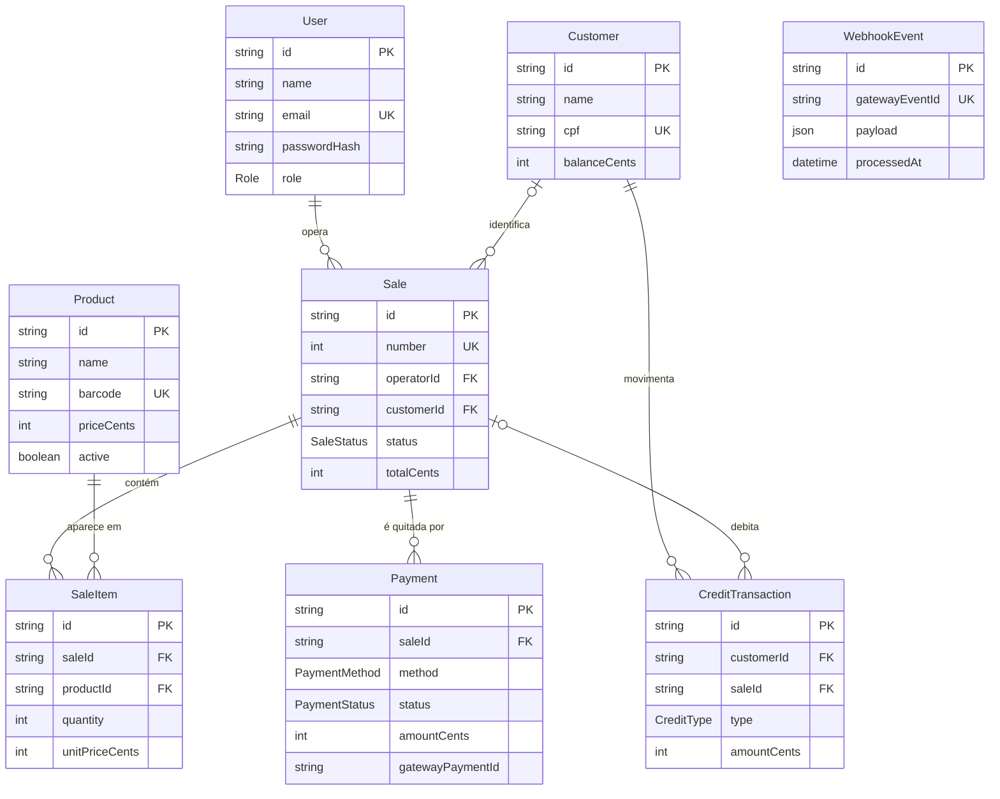

# 🛠️ Architecture / Software Design Document

**Projeto:** Bleep Checkout
**Versão:** 1.0.0 · decisões da Atividade 07
**Última atualização:** 08/10/2026

> 🤖 **O `prd.md` responde _o quê_ o produto faz. Este responde _onde as coisas
> moram e como se chamam_.** Detalhe de tela — rota, componente, contrato —
> **não** se decide aqui: isso é trabalho da spec de cada história.

---

## 🤖 1. Fontes de Contexto para a IA

> Onde a IDE agêntica busca a verdade. **Isto é o índice; a configuração mora
> nos arquivos** — documento não configura ferramenta.

| Fonte | Onde configurar | Serve para |
| :---- | :-------------- | :--------- |
| Constituição da IA | `.agents/rules/utf-rules.md` (via `CLAUDE.md`) | Regras inegociáveis: fases do SDD, 2 rodadas, revisores distintos, Git |
| Fluxos da IA | `.agents/workflows/` | PRD, backlog, jornadas e tokens, architecture, setup, ciclo por Issue, ciclo por tarefa, tutor |
| Agentes (subagentes) | `.agents/agents/` (cascas em `.claude/`, `.cursor/` e `.opencode/`) | Implementador, revisores, auditor final e tutor |
| Ficha da disciplina | `docs/checklist.md` | Regras do projeto, IDs e entregas |
| Design | [protótipo navegável](https://jhonpaulmr.github.io/bleep-prototipo/) · [projeto no Stitch](https://stitch.google.com/preview/3188655804959236628) · `docs/design-tokens.md` | Telas, cores, tipografia, estados de botão |

---

## 📦 2. Stack Tecnológica

> Definição **estrita**: nenhuma dependência entra sem aparecer aqui. Esta
> seção e o `package.json` contam a mesma história, ou o projeto já se perdeu.
> Aqui fica só a **linha** de versão; o número exato vive no `package.json`.
> Linhas conferidas em 08/10/2026 no registro do npm.

- **Ambiente:** Node.js **24+ (LTS)**. O Angular 22+ não instala em Node 22 anterior à 22.22.
- **Backend:** **NestJS 12+** + **Prisma ORM 7+** (driver `@prisma/adapter-pg`) + **PostgreSQL 17+**.
  - Dependências do backend: `@nestjs/config`, `@nestjs/jwt`, `@nestjs/swagger`, `class-validator`, `class-transformer`, `argon2` (hash de senha) e `mercadopago` (SDK oficial, sandbox).
- **Frontend:** **Angular 22+**.
- **Padrões de código do frontend (Angular):**
  - Componentes standalone (padrão atual — não se escreve `standalone: true`).
  - **Signals** para estado (ex.: o carrinho da venda).
  - Controle de fluxo `@if` / `@for` / `@switch` (não `*ngIf` / `*ngFor`).
  - `input()` / `output()` como funções; `inject()` em vez de injeção por construtor.
  - Lazy loading por rota de feature.
- **Estilo:** **Tailwind CSS 4+**. O HTML exportado do Stitch já vem em Tailwind. As cores, o espaçamento e a tipografia do tema vêm dos tokens do `docs/design-tokens.md`, pelo nome do papel (`primaria`, `perigo`…), nunca por hex solto no componente.
- **Testes:**

  | App | Ferramenta | O que cobre |
  | :-- | :--------- | :---------- |
  | `apps/api` | **Vitest** | Unidade: services e regras de domínio, sem banco |
  | `apps/api` | **Vitest + Supertest** | e2e: HTTP → banco real (Postgres do Docker) |
  | `apps/web` | **Vitest** (padrão do `ng test` no Angular 22+) | Services e componentes |
  | ambos | **ESLint** (`angular-eslint` no web) | Lint |

  **Comandos exatos**, a partir da raiz:

  ```bash
  npm test           # suíte dos dois apps
  npm run lint       # lint dos dois apps
  npm run test:e2e   # e2e da API — exige `docker compose up -d`
  ```

  Por app: `cd apps/api && npm test | npm run test:e2e | npm run lint` e `cd apps/web && npm test | npm run lint`.

### 🧱 2.1. Backend — regras estruturais

> Cada linha é um padrão cobrado por um ID da ficha. **É esta declaração que os
> revisores usam como critério fixo.**

| ID | Padrão |
| :-- | :----- |
| **ID6 · Camadas** | `Controller` só recebe e responde (HTTP) → `Service` tem a regra de negócio → `PrismaService` acessa o banco. Controller nunca acessa o Prisma; Service nunca conhece `Request`/`Response`. Um `Module` por domínio. |
| **ID7 · Entrada** | Toda entrada é um DTO com `class-validator`. `ValidationPipe` global com `whitelist: true`, `forbidNonWhitelisted: true` e `transform: true`. |
| **ID8 · Dados** | Acesso ao banco **só** via `PrismaService`. Operação que altera saldo, venda e pagamento juntos roda em `prisma.$transaction`. O débito de crédito é um update condicional (saldo ≥ total) para não deixar saldo negativo nem sob concorrência. Dinheiro em **centavos inteiros** (`Int`). |
| **ID9 · Autenticação** | `@nestjs/jwt`. `JwtAuthGuard` **global**, liberado com `@Public()` só no login e no webhook. `RolesGuard` com `@Roles('MANAGER' \| 'OPERATOR')`. Senha com `argon2`; o hash nunca sai na resposta. |
| **ID10 · Resposta e erro** | `ResponseInterceptor` global: sucesso sai como `{ data }`. `HttpExceptionFilter` global: erro sai como `{ statusCode, error, message, path, timestamp }`. Erros de domínio têm classe própria e viram **409** (conflito, ex.: código ou CPF duplicado) ou **422** (regra violada, ex.: saldo insuficiente). |
| **ID17 · Segredos** | `ConfigModule` com validação das variáveis no boot (a API não sobe sem elas): `DATABASE_URL`, `DIRECT_URL`, `JWT_SECRET`, `MP_ACCESS_TOKEN`, `MP_WEBHOOK_SECRET`, `WEB_ORIGIN`. Só o `.env.example` vai para o repositório; o `.env` fica no `.gitignore`; os valores de produção ficam nas variáveis do Render e da Vercel. |
| **ID18 · CI** | GitHub Actions em todo PR para a `main`: lint + teste dos dois apps + e2e da API com Postgres como *service* do job, além do check `explicacao`. |
| **ID19 · Deploy** | API no **Render** (Web Service). Banco no **Neon** com pooling: a `DATABASE_URL` (host `-pooler`) vai para o adapter em runtime; a `DIRECT_URL` (sem pooler) vai para o `prisma.config.ts` e é usada pelo `prisma migrate deploy`. Front na **Vercel**, com rewrite de SPA para `index.html`. CORS liberado só para `WEB_ORIGIN`. |
| **ID20 · Gateway** | **Mercado Pago em sandbox**, atrás da interface `PaymentGateway` (implementação real no módulo `payments`, fake nos testes; o TDD não depende de rede). A cobrança PIX nasce **no servidor**: um `Payment` ligado à `Sale`, com o `gatewayPaymentId` e o QR Code devolvidos pelo gateway. |
| **ID21 · Webhook** | `POST /webhooks/mercadopago` (`@Public()`), nesta ordem: (1) valida o `x-signature` (HMAC-SHA256 com `MP_WEBHOOK_SECRET`) e recusa o que não bater; (2) grava o `WebhookEvent` — o UNIQUE em `gatewayEventId` descarta notificação repetida; (3) **consulta o pagamento no gateway**, sem confiar só no corpo da notificação; (4) só então atualiza `Payment` e `Sale`. A simulação de confirmação existe só fora de produção e passa pelo mesmo handler. |

### 🌐 2.2. O contrato da API

> A documentação viva é gerada do código e servida pela própria API; o
> frontend deriva os contratos dela. Este documento **não mantém tabela de
> endpoints à mão**, e o arquivo gerado **não é commitado** — cópia no
> repositório desatualiza; a fonte é o endpoint vivo.

**Swagger (OpenAPI)** gerado com `@nestjs/swagger` a partir dos controllers e DTOs, servido em **`/docs`** (JSON em `/docs-json`). Os DTOs levam `@ApiProperty`, e as rotas protegidas declaram `@ApiBearerAuth()` (ID14).

---

## 🗂️ 3. Estrutura do Repositório (Monorepo)

> Uma pasta por aplicação, cada uma com o seu `package.json`. Sem npm
> workspaces, Nx ou Turborepo enquanto não houver código compartilhado de
> verdade — ferramenta sem problema para resolver é só custo.

```text
.
├── .agents/               # constituição, workflows e prompts dos agentes (§1)
├── .claude/ .cursor/ .opencode/   # cascas de cada ferramenta — só apontam para .agents/
├── .github/               # template de PR, Portão de Entendimento e CI
├── CLAUDE.md  AGENTS.md   # carregam a constituição em toda sessão
├── README.md              # a vitrine: o que é e como rodar
├── docker-compose.yml     # Postgres 17+ local (dev e e2e)
├── package.json           # só scripts que chamam os apps (test, lint, test:e2e)
├── docs/                  # prd.md, user-flows.md, design-tokens.md, este arquivo, checklist.md e guias
├── specs/                 # uma pasta por história implementada
└── apps/
    ├── api/               # NestJS 12+ + Prisma 7+
    │   ├── prisma/        # schema.prisma + migrations/
    │   ├── prisma.config.ts
    │   ├── src/
    │   │   ├── common/    # ResponseInterceptor, HttpExceptionFilter, guards, @Roles, @Public, erros de domínio
    │   │   ├── config/    # ConfigModule + validação das variáveis
    │   │   ├── prisma/    # PrismaService (único ponto de acesso ao banco)
    │   │   └── modules/   # um módulo por domínio: auth, users, products, customers, sales, payments, webhooks
    │   │                  # (cada um: *.module, *.controller, *.service, dto/ e *.spec.ts ao lado)
    │   └── test/          # e2e (Vitest + Supertest)
    └── web/               # Angular 22+
        └── src/app/
            ├── core/      # auth (service, interceptor JWT, guards de rota por papel) e layout (cabeçalho por papel)
            ├── shared/ui/ # componentes reutilizáveis: botão com os 5 estados, selo de status da venda
            └── features/  # login, checkout (caixa + pagamento + PIX), pending-sales, products, customers, operators
                           # (cada uma: pages/, components/ e data/ — o *Service que fala com a API)
```

---

## 🏗️ 4. Arquitetura Frontend

> 📏 **A regra que vale para qualquer stack: componente não fala com o
> servidor.** Todo acesso à API passa por uma camada de repositório/serviço —
> mudança de contrato mexe só nessa camada, nunca nas telas.

- **Camada de dados:** cada feature tem `data/<feature>.service.ts` com `HttpClient`, o **único** lugar que conhece URL e formato da API. Ele desembrulha o `{ data }` do `ResponseInterceptor`. Componentes de página consomem o service; componentes de `components/` e de `shared/ui/` só recebem `input()` e emitem `output()`.
- **Dependências entre pastas:** `features/*` pode importar de `core/` e `shared/`. `shared/` não importa de `features/`. Uma feature não importa de outra; o que for comum sobe para `shared/` ou `core/`.
- **Autenticação no front (ID16):** o token JWT fica no `sessionStorage`. Um interceptor HTTP anexa `Authorization: Bearer`, e uma resposta 401 limpa a sessão e leva ao Login. Guards de rota (`canMatch`) separam as rotas do Operador (caixa e pendentes) das do Gerente (produtos, clientes e operadores). O menu do cabeçalho segue o papel.
- **Estado:** signals por feature (ex.: a venda em montagem). A confirmação do PIX é acompanhada por polling do status da venda no service da feature `checkout`, até ela sair de `PENDING`.

---

## 🗄️ 5. Arquitetura de Dados

### 📖 5.1. Glossário Técnico (Mapeamento)

> A ponte entre o português do negócio (PRD §2) e o inglês do código.
> **Dados e código em inglês, interface em português.**

| Termo PRD (PT-BR) | Entidade técnica (EN) | Atributos principais |
| :---------------- | :-------------------- | :------------------- |
| Gerente / Operador de caixa (Acesso) | `User` | `id`, `name`, `email` (único), `passwordHash`, `role` (`MANAGER` \| `OPERATOR`), `createdAt` |
| Produto (Produto desativado) | `Product` | `id`, `name`, `barcode` (único, EAN-13), `priceCents`, `active`, `createdAt` |
| Cliente | `Customer` | `id`, `name`, `cpf` (único), `balanceCents` (≥ 0), `createdAt` |
| Crédito do cliente (movimentação) | `CreditTransaction` | `id`, `customerId`, `saleId?`, `type` (`INITIAL` \| `TOP_UP` \| `SALE_DEBIT`), `amountCents`, `createdAt` |
| Venda (Venda pendente) | `Sale` | `id`, `number`, `operatorId`, `customerId?`, `status` (`OPEN` \| `PENDING` \| `COMPLETED` \| `CANCELED`), `totalCents`, `createdAt`, `completedAt?` |
| Item de venda (Quantidade) | `SaleItem` | `id`, `saleId`, `productId`, `quantity` (> 0), `unitPriceCents`; único (`saleId`, `productId`) |
| Pagamento / Forma de pagamento (PIX, Pagamento externo) | `Payment` | `id`, `saleId`, `method` (`PIX` \| `CUSTOMER_CREDIT` \| `EXTERNAL_CREDIT` \| `EXTERNAL_DEBIT`), `status` (`PENDING` \| `APPROVED` \| `DECLINED` \| `ABANDONED`), `amountCents`, `gatewayPaymentId?`, `qrCode?`, `createdAt` |
| (confirmação do gateway) | `WebhookEvent` | `id`, `gatewayEventId` (único), `payload`, `processedAt` |

> O `CreditTransaction` é a trilha interna de cada movimentação de saldo,
> gravada na mesma transação que altera o `balanceCents`. Não é o extrato do
> cliente, que continua fora de escopo e sem tela.

**Termos do PRD que não viraram entidade** (o sistema não guarda uma lista deles, com id para cada um):

| Termo PRD | Onde mora | Por quê |
| :-------- | :-------- | :------ |
| Código de barras | atributo `Product.barcode` | Identifica um produto; não existe sem ele |
| Quantidade | atributo `SaleItem.quantity` | É um número do item, não uma coisa à parte |
| Venda pendente | valor `PENDING` de `Sale.status` | É um estado da venda |
| PIX · Pagamento externo · Forma de pagamento | valores de `Payment.method` | São o meio usado num pagamento |
| Simulador de caixa | tela (feature `checkout` do front) | É onde a venda é montada, não um dado guardado |

### 📊 5.2. Diagrama ER (Mermaid)

> Inclui as entidades que o escopo mínimo da ficha exige: Produto 1:N Item de
> venda e Cliente 1:N Venda, e a separação entre pedido (`Sale`) e pagamento
> (`Payment`) do ID20.



### 🌍 5.3. O banco por ambiente

| Ambiente | Onde roda | Como conecta |
| :--- | :--- | :--- |
| **Local** | PostgreSQL em Docker na máquina (`docker compose up -d`) — nasce na Atividade 08 | `DATABASE_URL` e `DIRECT_URL` no `.env`, fora do Git, as duas apontando para `localhost` |
| **CI** | PostgreSQL em container, como *service* do job do GitHub Actions | `DATABASE_URL` e `DIRECT_URL` definidas pelo próprio workflow, só para o banco descartável do job |
| **Produção** | Neon.tech, região São Paulo — nasce no deploy | `DATABASE_URL` (host `-pooler`, runtime via adapter) e `DIRECT_URL` (host direto, migrations) nos secrets do Render |

> 🔒 Credenciais **nunca** aparecem no repositório — nem em código, nem em
> YAML, nem em doc. Só nos *secrets* da plataforma.

---

## 🗺️ 6. Mapa de Domínios

> **Este índice cresce.** Não é para preencher agora: **uma linha por história
> implementada**. Ele diz **onde mora** cada domínio e quem o protege — rota e
> contrato ficam na documentação viva da API (§2.2) e na spec de cada história,
> nunca copiados aqui.

| Domínio | Módulo (pasta) | Guard | Dados (repository) | US |
| :------ | :------------- | :---- | :----------------- | :-- |
| | | | | |

---

## 📅 7. Histórico

| Data | Versão | O que mudou |
| :--- | :----- | :---------- |
| 08/10/2026 | 1.0.0 | Versão inicial via `/utf-architecture`: Angular 22+, NestJS 12+ + Prisma 7+ + PostgreSQL 17+, Neon, Render, Vercel, Mercado Pago sandbox |

---

## 🛑 O que ainda **não** está neste documento

Detalhes de funcionalidade — DTOs de endpoints específicos, máquinas de estado
de uma história — **não entram aqui**: nascem sob demanda no `spec.md` de cada
história. Este documento guarda só o que vale para o sistema inteiro.
