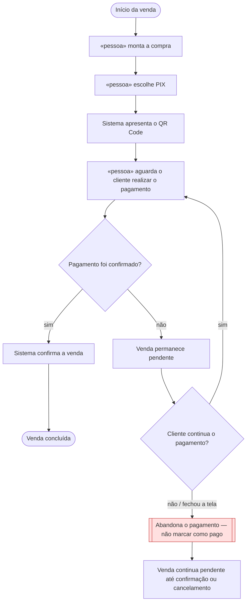

# 🗺️ Jornadas de Usuário

**Projeto:** Bleep Checkout
**Versão:** 1.0.0 · jornada principal de pagamento
**Última atualização:** 20/09/2026

> Esta jornada descreve o caminho do operador desde a montagem da venda até a confirmação do pagamento PIX, incluindo o comportamento quando a pessoa abandona o pagamento.
>
> Regra de negócio continua em `prd.md`; este documento descreve o caminho vivido na operação.

---

## Jornada 1 — Finalizar uma venda com PIX

**Story:** US06
**Critérios que ela marca:** sai do site e volta · depende do tempo · depende de outra pessoa agir · pode ser abandonada

**O que decidimos sobre o nó vermelho:** se o cliente fechar a tela, desistir ou interromper o pagamento antes da confirmação do PIX, a venda não será considerada paga. Ela permanece pendente porque o fato de a tela ter sido fechada não é prova de pagamento. A venda só pode mudar para concluída quando existir uma confirmação válida do PIX ou quando o operador seguir uma forma de pagamento que tenha sido efetivamente confirmada. Assim, o sistema evita registrar uma venda como paga apenas porque o QR Code foi apresentado.

---

## Dúvidas em aberto

| # | Dúvida | Onde ela precisa ser resolvida |
| --- | --- | --- |
| 1 | Qual será o tempo máximo de permanência de uma venda PIX pendente antes de uma eventual expiração automática? | Definição do fluxo de pagamento na etapa de detalhamento do produto. |
| 2 | A venda PIX pendente poderá ser reaberta pelo operador para acompanhar uma confirmação posterior? | Definição detalhada das jornadas e estados da venda. |
| 3 | Qual será o link final do protótipo de 3 a 5 telas? | Protótipo de interface. |
